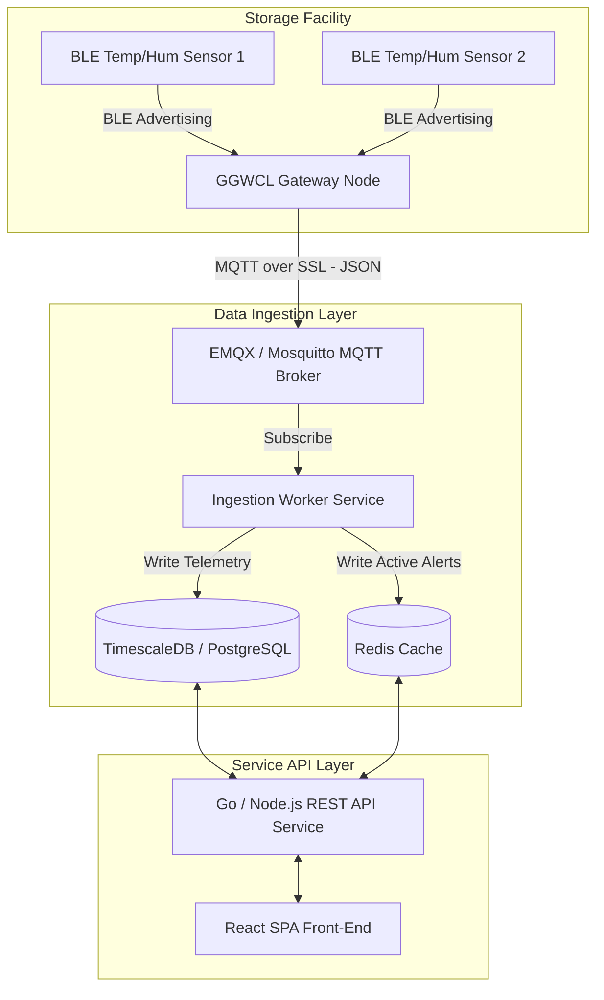

# Thinxsense IIoT Platform: Backend & API Architecture Specification (KT)

This document serves as the Knowledge Transfer (KT) architectural blueprint for transitioning the revamped **thinxsense Industrial IoT Platform** from our React mockup/simulation layer to a high-scale, production-ready backend service.

---

## 🌐 1. System Topology & Data Flow

Below is the end-to-end data ingestion pipeline and service architecture for high-frequency BLE telemetry:



### Ingestion Protocol:
1. **Sensor Node to Gateway**: BLE Advertising beacons containing packed binary payloads (MAC Address, Temp, Humidity, Battery, RSSI).
2. **Gateway to MQTT Broker**: JSON payloads sent via MQTTS (`port 8883`) at defined sampling intervals:
   ```json
   {
     "gateway_id": "GGWCL00061",
     "timestamp": "2026-07-02T11:43:53Z",
     "sensors": [
       { "sensor_id": "H9B00045", "temp": 31.2, "hum": 88.0, "batt": 12 },
       { "sensor_id": "H9B00046", "temp": 24.1, "hum": 41.2, "batt": 91 }
     ]
   }
   ```

---

## 💾 2. Production Database Schema Design

For telemetry databases, **PostgreSQL** with the **TimescaleDB extension** (hyper-tables for time-series logs) is recommended for scalable chunking.

### 2.1 Groups Table (`groups`)
Stores the sensor organization groups.
```sql
CREATE TABLE groups (
    id SERIAL PRIMARY KEY,
    name VARCHAR(50) UNIQUE NOT NULL,
    description TEXT,
    facility_location VARCHAR(100), -- Notes where this group is located (e.g. Cold Room 2, Rack 3)
    created_at TIMESTAMP WITH TIME ZONE DEFAULT CURRENT_TIMESTAMP
);
CREATE INDEX idx_groups_name ON groups(name);
```

### 2.2 Sensors Table (`sensors`)
Stores active device configurations.
```sql
CREATE TABLE sensors (
    id VARCHAR(30) PRIMARY KEY, -- e.g., H9B00045
    name VARCHAR(50) NOT NULL,
    group_name VARCHAR(50) REFERENCES groups(name) ON DELETE SET NULL,
    physical_location VARCHAR(100), -- Specific physical rack/shelf positioning
    compliance_threshold_temp_max NUMERIC(4,2) DEFAULT 25.0,
    compliance_threshold_temp_min NUMERIC(4,2) DEFAULT 2.0,
    status VARCHAR(15) DEFAULT 'online', -- online, offline, warning
    last_seen TIMESTAMP WITH TIME ZONE,
    created_at TIMESTAMP WITH TIME ZONE DEFAULT CURRENT_TIMESTAMP
);
CREATE INDEX idx_sensors_group ON sensors(group_name);
```

### 2.3 Sensor Telemetry Hyper-table (`sensor_logs`)
High-frequency time-series table partition.
```sql
CREATE TABLE sensor_logs (
    time TIMESTAMP WITH TIME ZONE NOT NULL,
    sensor_id VARCHAR(30) NOT NULL,
    temperature NUMERIC(4,2),
    humidity NUMERIC(4,2),
    battery INTEGER
);
-- Convert to TimescaleDB hypertable partitioned by 7-day chunks
SELECT create_hypertable('sensor_logs', 'time', chunk_time_interval => INTERVAL '7 days');
CREATE INDEX idx_sensor_logs_sensor_time ON sensor_logs(sensor_id, time DESC);
```

### 2.4 Active Excursions Table (`alerts`)
```sql
CREATE TABLE alerts (
    id VARCHAR(30) PRIMARY KEY, -- e.g., ALT-9921
    sensor_id VARCHAR(30) REFERENCES sensors(id) ON DELETE CASCADE,
    triggered_at TIMESTAMP WITH TIME ZONE NOT NULL,
    resolved_at TIMESTAMP WITH TIME ZONE,
    param_type VARCHAR(20) NOT NULL, -- Temperature, Humidity
    value_at_trigger NUMERIC(4,2) NOT NULL,
    deviation_magnitude NUMERIC(4,2) NOT NULL,
    duration_minutes INTEGER DEFAULT 0,
    esi_score NUMERIC(6,1) GENERATED ALWAYS AS (deviation_magnitude * duration_minutes) STORED,
    state VARCHAR(20) DEFAULT 'unacknowledged', -- unacknowledged, acknowledged, resolved
    handover_notes TEXT
);
CREATE INDEX idx_alerts_state_esi ON alerts(state, esi_score DESC);
```

---

## ⚡ 3. REST API Endpoints Specification

All data retrieval is query-filtered on the database side (no client-side over-fetching).

| Endpoint | Method | Query Parameters | Description |
| :--- | :--- | :--- | :--- |
| `/api/groups` | `GET` | `search_query` (optional) | List groups. Supports keyword filtering. |
| `/api/groups` | `POST` | JSON body (`name`, `desc`, `location`) | Register a new monitoring group. |
| `/api/groups/:name` | `DELETE` | None | Delete a group and unassign its sensors. |
| `/api/sensors` | `GET` | `group_name`, `status`, `search_query` | List sensors. Supports strict group filters. |
| `/api/sensors` | `POST` | JSON body (`id`, `temp`, `hum`, `group`, `location`) | Register a new BLE sensor node. |
| `/api/sensors/:id` | `DELETE` | None | Remove a sensor node and clear associated alerts. |
| `/api/alerts` | `GET` | `state` (`unacknowledged`/`acknowledged`), `search_query` | List active alerts. Default sorts by ESI. |
| `/api/alerts/:id/acknowledge`| `POST` | JSON body (`operator_notes`) | Sign-off/Acknowledge an active excursion. |

---

## 🧠 4. Core Core Validation Logic (SQL/Go code)

### 4.1 Excursion Severity Index (ESI) Database Sorting
Instead of sorting on the client, database engines calculate ESI on the fly and query the most critical excursions:
```sql
SELECT 
    id, 
    sensor_id, 
    triggered_at, 
    value_at_trigger,
    deviation_magnitude, 
    duration_minutes, 
    (deviation_magnitude * duration_minutes) as esi_score,
    state
FROM alerts
WHERE state = 'unacknowledged'
ORDER BY esi_score DESC;
```

### 4.2 Neighbour Validation Engine (Algorithm)
To distinguish between **localized door opening events/faulty sensors** and **genuine room-wide excursions**, the backend implements a `3.0°C` deviation threshold:

```go
package main

import (
	"math"
)

type ValidationVerdict string

const (
	VerdictIsolated ValidationVerdict = "Isolated Monitoring"
	VerdictFault    ValidationVerdict = "Sensor Fault (Mismatched)"
	VerdictExcursion ValidationVerdict = "Excursion (Verified)"
)

// EvaluateNeighbourValidation calculates neighbor consensus on abnormal readings
func EvaluateNeighbourValidation(sensorTemp float64, neighborTemps []float64) (ValidationVerdict, float64) {
	if len(neighborTemps) == 0 {
		return VerdictIsolated, 0.0
	}

	// Calculate average temperature of active neighbor nodes
	sum := 0.0
	for _, t := range neighborTemps {
		sum += t
	}
	neighborAverage := sum / float64(len(neighborTemps))
	deviation := math.Abs(sensorTemp - neighborAverage)

	const DeviationThreshold = 3.0 // 3.0°C deviation limit
	const ComplianceLimit = 25.0

	if sensorTemp > ComplianceLimit {
		if deviation > DeviationThreshold {
			// Selected sensor is hot, but neighbors are normal
			return VerdictFault, deviation
		}
		// Sibling consensus - all sensors are elevated
		return VerdictExcursion, deviation
	}

	return "Normal", deviation
}
```

---

## ⚡ 5. Production Optimization Strategy

1. **Redis Caching**: Cache the most recent telemetries of all sensors in Redis. This prevents hitting TimescaleDB for rendering the sidebar list and gateway statuses.
2. **Database Compacting**: Configure TimescaleDB compression policies to compress logs older than 14 days (saving up to 90% storage space).
3. **Database Indexing**: Always index `sensor_id` and `time` together as a composite B-Tree index to speed up time-series chart requests.
